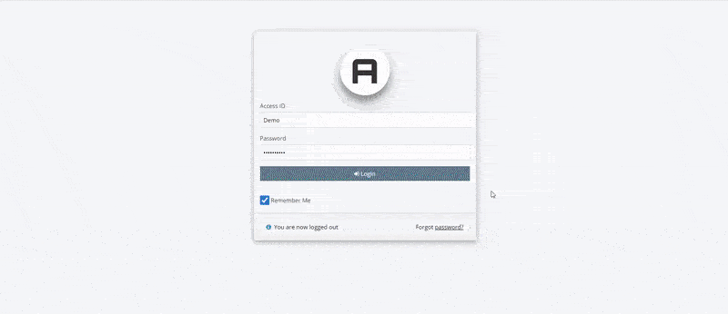

# address-book
An elegantly simple but powerful address book application written in PHP7, HTML5, CSS3, JavaScript and utilizing W3.CSS framework as well as 1 MySQL or MariaDB database. I am an avid fan of Bootstrap, however, it's quite heavy. For a demo script like this, I felt it was entirely too much. W3.CSS provided an assortment of themes straight out of the box, is light-weight and fairly well documented. While I disagree with the author's usage of inline JavaScript, I am quite pleased with its performance and lack of jQuery.

# Installation
1. On your server, create a new database: 'address_book'
2. Open address_book.sql in your favorite text editor. Copy the contents of the file and run through PHPMyAdmin.
3. Upload all files to your public directory (public_html, htdocs, etc) into a directory called 'address_book'

# Optional
If you would like to install in a different directory, open /includes/initialize.php and edit the $public_end variable on line 57 to suit your needs.

The default login information is "Demo" for the user, case sensitive. "Demopass1#" is the password, also case sensitive. 

# Important
Once you're logged in, create a new user while ensuring you set it up as an Owner (not a user or manager) and remove the Demo User profile
OR
simply modify the Demo User profile to suit your needs.

By default, the password requirements are: Must be at least 5 characters in length, contain 1 upper and 1 lower case letter, 1 number, and 1 symbol (#, $, %, ^ etc).

The project is still being developed. It is in a beta stage at this point. It would be best to only use this script in a development or personal environment as opposed to a live website.

If there are features that you would like to see built into this script, please do let me know or create a pull request.
